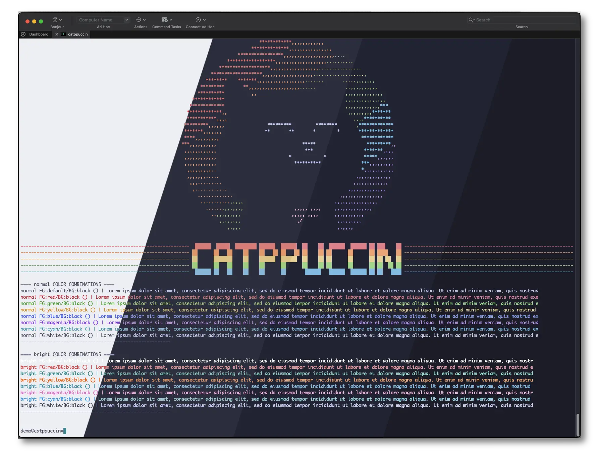
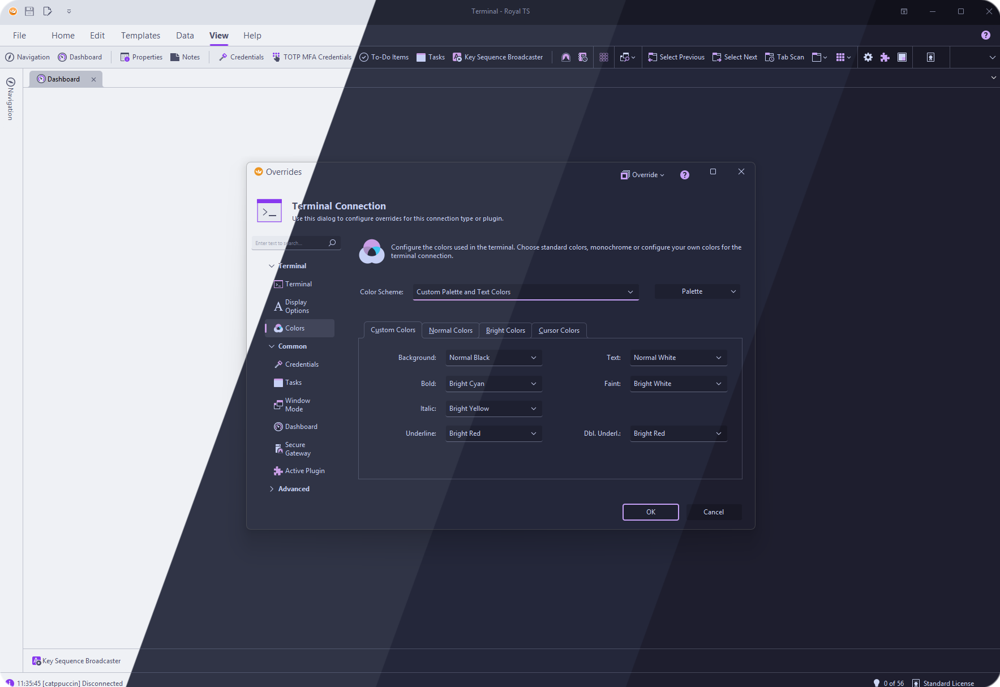
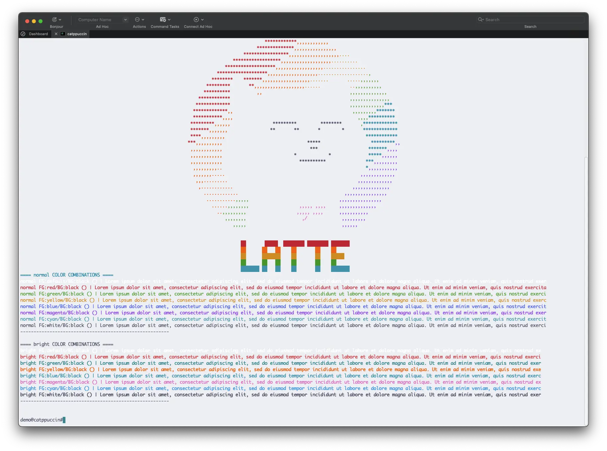
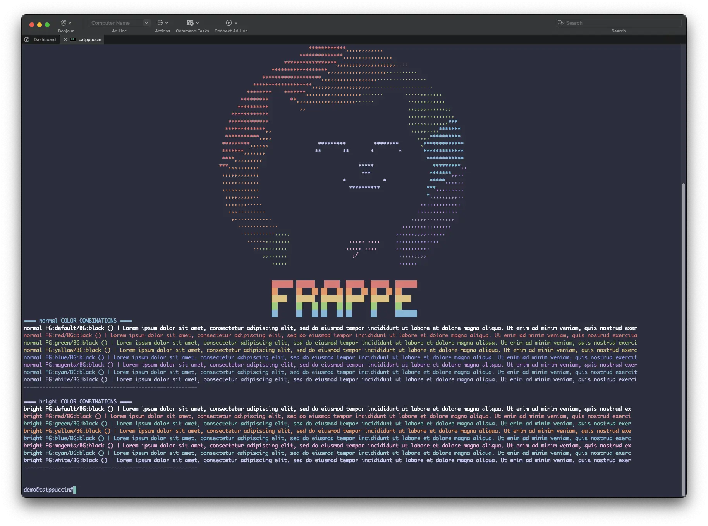
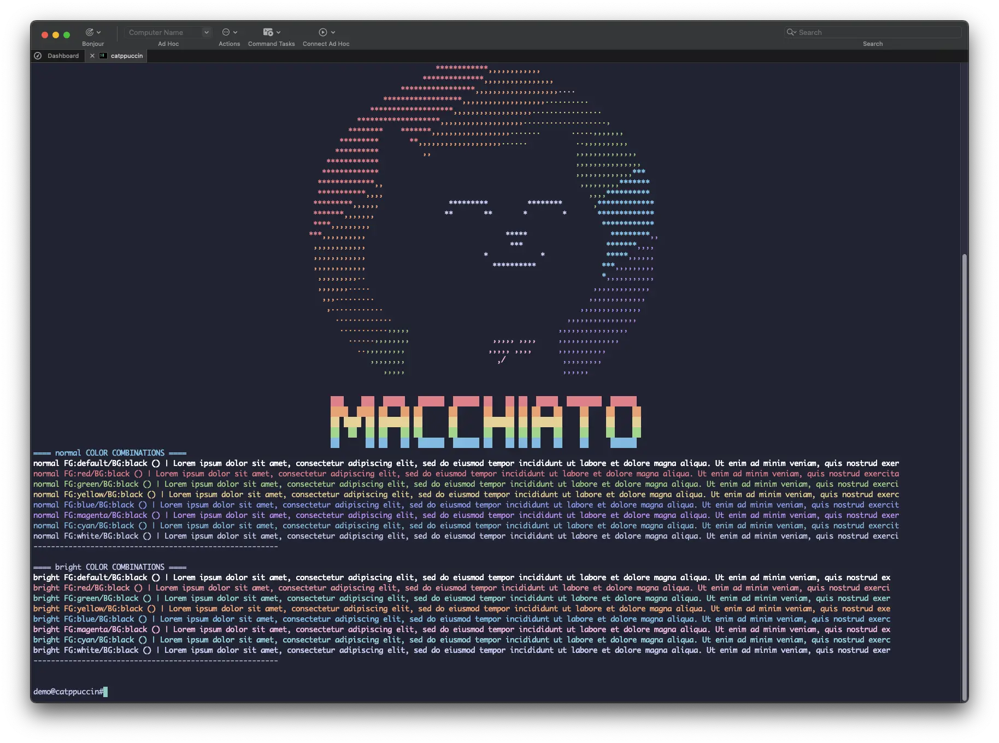
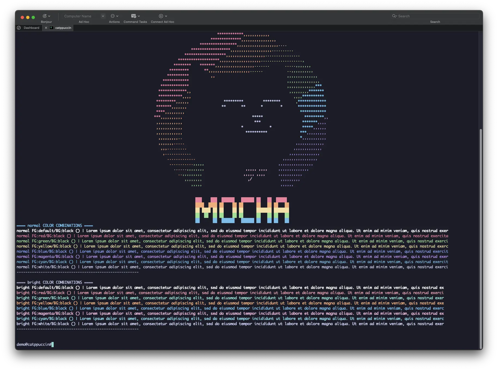

<h3 align="center">
	<br/>
	
	Catppuccin for <a href="https://www.royalapps.com/ts/win/features">Royal TS</a>
	
</h3>

<p align="center">
	<a href="https://github.com/gravelfreeman/royalts-catppuccin/stargazers"></a>
	<a href="https://github.com/gravelfreeman/royalts-catppuccin/issues"></a>
	<a href="https://github.com/gravelfreeman/royalts-catppuccin/contributors"></a>
</p>

<p align="center">
	
</p>

<p align="center">
	
</p>

## Previews

<details>
<summary>🌻 Latte</summary>
	
</details>
<details>
<summary>🪴 Frappé</summary>
	
</details>
<details>
<summary>🌺 Macchiato</summary>
		
</details>
<details>
<summary>🌿 Mocha</summary>
	
</details>

## Usage

Royal TS Terminal Theme
<blockquote>
<br/>

1. Right click a Terminal Connection > Properties > Colors.

2. Click on Palette > Manage > Import

3. Import corresponding *[catppuccin-latte.rtcp](/assets/catppuccin-latte.rtcp)*, *[catppuccin-frappe.rtcp](/assets/catppuccin-frappe.rtcp)*, *[catppuccin-macchiato.rtcp](/assets/catppuccin-macchiato.rtcp)*, or *[catppuccin-mocha.rtcp](/assets/catppuccin-mocha.rtcp)* color profile and press OK.

###### [For further information, consult the RoyalTS manual.](https://docs.royalapps.com/r2023/royalts/user-interface/color-palettes.html)
<br/>
</blockquote>
<br/><br/>

Royal TS Interface Theme (not compatible with Royal TSX)
<br/>

<blockquote>
<br/>
1. Copy one of the below theme links:
</br>
<details>
    <summary>🌻 Latte</summary>

```
https://royalapps.com/colorscheme?CompactUserInterface=2&UseRoundedCorners=2&AccentColor=2&AccentBaseColor=8839EF&BackgroundP200=E6E9EF&BackgroundP100=EFF1F5&Background0=EFF1F5&BackgroundM100=BCC0CC&BackgroundM200=CCD0DA&Foreground100=4C4F69&Foreground50=8C8FA1&Foreground25=9CA0B0&EditBackground0=E6E9EF&EditBackgroundM50=BCC0CC&EditBackgroundM100=CCD0DA&EditBackgroundM200=BCC0CC&EditBackgroundM300=ACB0BE&EditForeground100=4C4F69&EditForeground50=8C8FA1&EditForeground25=9CA0B0&Line100=ACB0BE&Line50=BCC0CC&Line25=ACB0BE&LineGradient100C1=EFF1F5&LineGradient100C2=9CA0B0&LineGradient50C1=EFF1F5&LineGradient50C2=CCD0DA&PrimaryBackgroundP100=BCC0CC&PrimaryBackground0=8839EF&PrimaryBackgroundM100=8839EF&PrimaryBackgroundM200=8839EF&PrimaryForeground100=EFF1F5&PrimaryForeground25=EFF1F5&SecondaryBackground0=DCE0E8&SecondaryBackgroundM100=E6E9EF&SecondaryBackgroundM200=CCD0DA&SecondaryForeground100=4C4F69&SecondaryForeground25=8C8FA1&Red=4C4F69&Green=4C4F69&Blue=8839EF&Yellow=4C4F69&Black=4C4F69&White=E6E9EF&Gray=4C4F69
```
</details>

<details>
    <summary>🪴 Frappé</summary>

```
https://royalapps.com/colorscheme?CompactUserInterface=2&UseRoundedCorners=2&AccentColor=2&AccentBaseColor=CA9EE6&BackgroundP200=232634&BackgroundP100=292C3C&Background0=303446&BackgroundM100=414559&BackgroundM200=51576D&Foreground100=C6D0F5&Foreground50=838BA7&Foreground25=737994&EditBackground0=232634&EditBackgroundM50=414559&EditBackgroundM100=51576D&EditBackgroundM200=414559&EditBackgroundM300=626880&EditForeground100=C6D0F5&EditForeground50=838BA7&EditForeground25=737994&Line100=626880&Line50=414559&Line25=626880&LineGradient100C1=303446&LineGradient100C2=737994&LineGradient50C1=303446&LineGradient50C2=51576D&PrimaryBackgroundP100=414559&PrimaryBackground0=CA9EE6&PrimaryBackgroundM100=CA9EE6&PrimaryBackgroundM200=CA9EE6&PrimaryForeground100=303446&PrimaryForeground25=303446&SecondaryBackground0=232634&SecondaryBackgroundM100=232634&SecondaryBackgroundM200=51576D&SecondaryForeground100=C6D0F5&SecondaryForeground25=838BA7&Red=C6D0F5&Green=C6D0F5&Blue=CA9EE6&Yellow=C6D0F5&Black=C6D0F5&White=232634&Gray=C6D0F5
```
</details>
<details>
    <summary>🌺 Macchiato</summary>

```
https://royalapps.com/colorscheme?CompactUserInterface=2&UseRoundedCorners=2&AccentColor=2&AccentBaseColor=C6A0F6&BackgroundP200=181926&BackgroundP100=1E2030&Background0=24273A&BackgroundM100=363A4F&BackgroundM200=494D64&Foreground100=CAD3F5&Foreground50=8087A2&Foreground25=6E738D&EditBackground0=181926&EditBackgroundM50=363A4F&EditBackgroundM100=494D64&EditBackgroundM200=363A4F&EditBackgroundM300=5B6078&EditForeground100=CAD3F5&EditForeground50=8087A2&EditForeground25=6E738D&Line100=5B6078&Line50=363A4F&Line25=5B6078&LineGradient100C1=24273A&LineGradient100C2=6E738D&LineGradient50C1=24273A&LineGradient50C2=494D64&PrimaryBackgroundP100=363A4F&PrimaryBackground0=C6A0F6&PrimaryBackgroundM100=C6A0F6&PrimaryBackgroundM200=C6A0F6&PrimaryForeground100=24273A&PrimaryForeground25=24273A&SecondaryBackground0=181926&SecondaryBackgroundM100=181926&SecondaryBackgroundM200=494D64&SecondaryForeground100=CAD3F5&SecondaryForeground25=8087A2&Red=CAD3F5&Green=CAD3F5&Blue=C6A0F6&Yellow=CAD3F5&Black=CAD3F5&White=181926&Gray=CAD3F5
```
</details>
<details>
    <summary>🌿 Mocha</summary>

```
https://royalapps.com/colorscheme?CompactUserInterface=2&UseRoundedCorners=2&AccentColor=2&AccentBaseColor=CBA6F7&BackgroundP200=11111B&BackgroundP100=181825&Background0=1E1E2E&BackgroundM100=313244&BackgroundM200=45475A&Foreground100=CDD6F4&Foreground50=A6ADC8&Foreground25=9399B2&EditBackground0=11111B&EditBackgroundM50=313244&EditBackgroundM100=45475A&EditBackgroundM200=313244&EditBackgroundM300=6C7086&EditForeground100=CDD6F4&EditForeground50=A6ADC8&EditForeground25=9399B2&Line100=6C7086&Line50=313244&Line25=6C7086&LineGradient100C1=1E1E2E&LineGradient100C2=9399B2&LineGradient50C1=1E1E2E&LineGradient50C2=45475A&PrimaryBackgroundP100=313244&PrimaryBackground0=CBA6F7&PrimaryBackgroundM100=CBA6F7&PrimaryBackgroundM200=CBA6F7&PrimaryForeground100=1E1E2E&PrimaryForeground25=1E1E2E&SecondaryBackground0=11111B&SecondaryBackgroundM100=11111B&SecondaryBackgroundM200=45475A&SecondaryForeground100=CDD6F4&SecondaryForeground25=A6ADC8&Red=CDD6F4&Green=CDD6F4&Blue=CBA6F7&Yellow=CDD6F4&Black=CDD6F4&White=11111B&Gray=CDD6F4
```
</details>

</br>

2. Navigate to Royal TS > Options > Appearances

3. A message will appear notifying you a configuration was found in the clipboard.


4. Press the *Apply* text to overwrite your current theme configuration.

###### [For further information, consult the RoyalTS manual.](https://docs.royalapps.com/r2023/royalts/user-interface/color-palettes.html)
<br/>

</blockquote>

## 💝 Thanks to

- [grokdesigns](https://github.com/grokdesigns)
- [gravelfreeman](https://github.com/gravelfreeman)

&nbsp;

<p align="center">
	
</p>

<p align="center">
	Copyright &copy; 2021-present <a href="https://github.com/catppuccin" target="_blank">Catppuccin Org</a>
</p>

<p align="center">
	<a href="https://github.com/catppuccin/catppuccin/blob/main/LICENSE"></a>
</p>